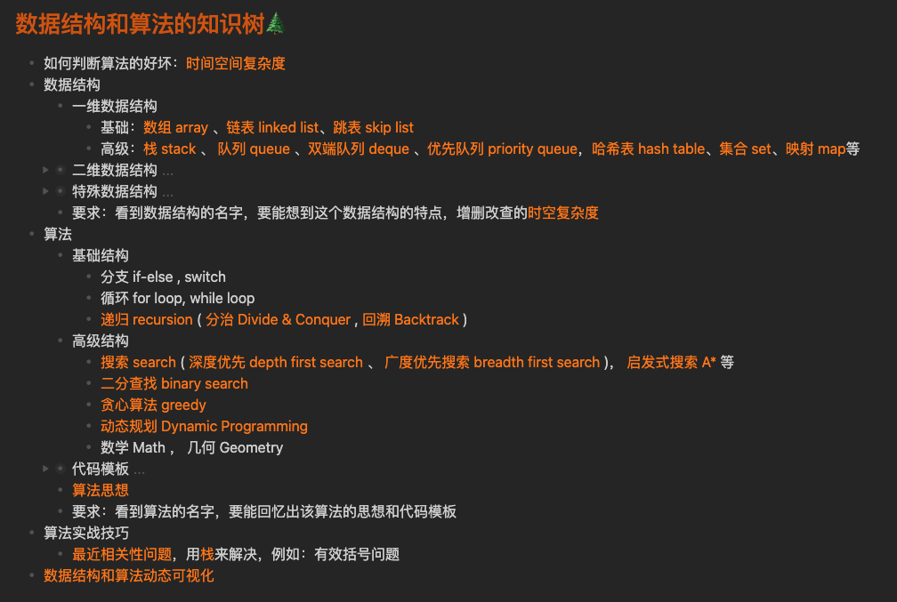
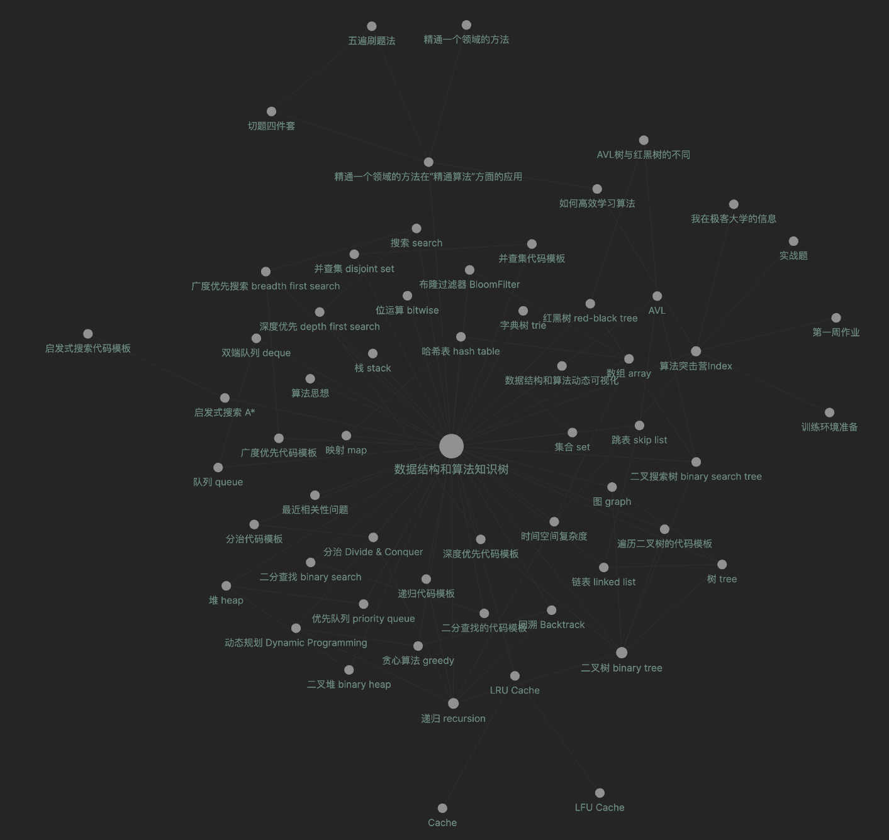

# 算法突击营毕业总结

在参加算法突击营的5周时间中，共投入34小时的净时间来学习：

1. 完成所有课程内容的学习（30几个视频）
2. 完成5周的作业（每周5题）
3. 完成考试
4. 完成数据结构和算法知识树的构建

获得如下收获：

1. 知道了学习数据架构和算法的套路，让自己能够高效学习，让自己有信心能学好数据架构和算法
2. 构建出了自己对数据结构与算法的知识树，让自己不再因为缺少对数据结构和算法体系化的理解而产生畏惧之心，让自己能通过这棵知识树不断积累、扩展自己对数据结构和算法的理解

3. 获得了优质学习资源和一帮优秀的同学，能让自己在遇到问题时，能够有资源解决

由于自身时间方面的限制，投入学习的时间比较少，算法题没能做到“五刷”，后续做学习计划，开展重点算法题的“五刷之路“。

感谢超哥、班班、助教们的付出，感谢极客时间提供的平台，感谢一起学习的大家，我们技术世界再见。

